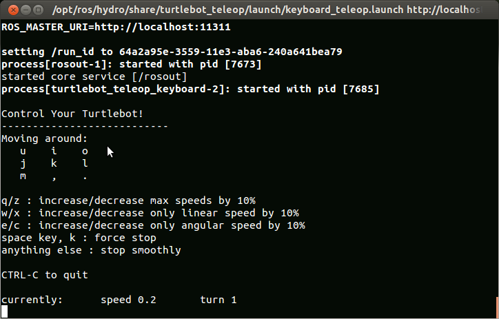

Run Tele-op
==============   

The following command allows you to tele-op your TurtleBot with a keyboard. This can be run on either your TurtleBot netbook or your workstation PC, however it is recommended that you use your workstation PC so you can control your TurtleBot remotely.

.. code:: bash

	$ roslaunch turtlebot_teleop keyboard_teleop.launch 

