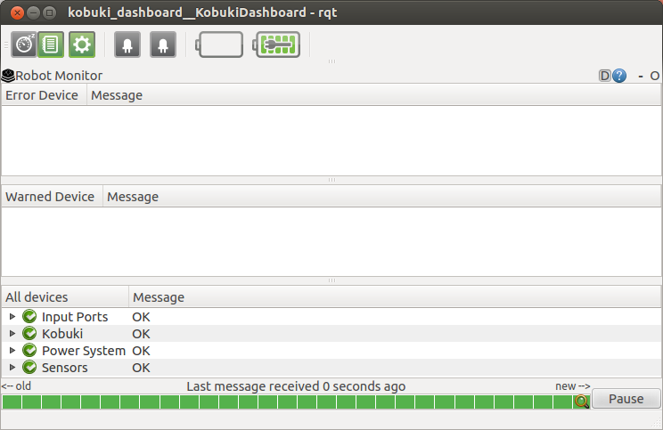

TurtleBot Dashboard
==========================  

The `TurtleBot Dashboard <http://www.ros.org/wiki/turtlebot_dashboard>`_ provides a wide range of diagnostic information, including the current battery levels for the robot base and the netbook, and the state of the power breakers. This GUI can be run locally on the robot, or on a workstation that has been configured to use the TurtleBot as the ROS Master.

